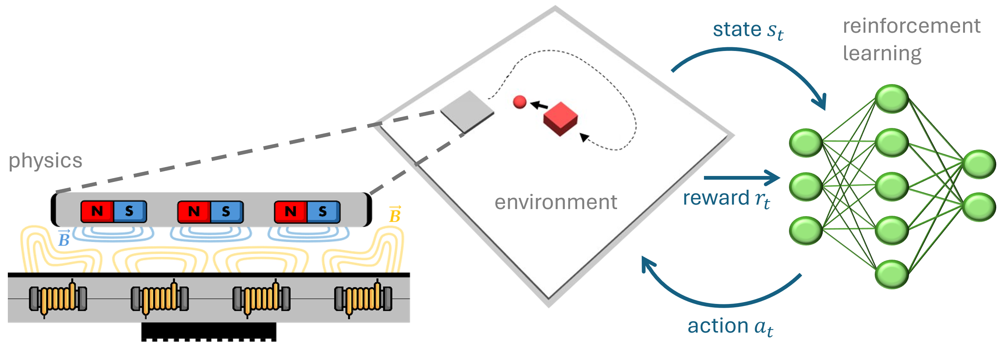

.. Gymnasium-Planar-Robotics documentation master file, created by
   sphinx-quickstart on Tue Apr 16 22:11:26 2024.
   You can adapt this file completely to your liking, but it should at least
   contain the root `toctree` directive.

Gymnasium-Planar-Robotics
=========================
`Gymnasium-Planar-Robotics (GymPR) <https://github.com/ubi-coro/gymnasium-planar-robotics/>`_ is a library that contains reinforcement learning (RL) environments for motion planning
and object manipulation in the field of planar robotics. The main component of every environment is a magnetic levitation system, a so-called planar motor system, that consists of two basic
components that are shown in the Figure below. Firstly, mobile permanent magnets, so-called movers, consist of a housing and a complex permanent magnet structure on the lower side of 
the mover. Secondly, static motor modules, so-called tiles, are the active components of the drive system. As shown in the Figure, the tiles enable the 
coil-induced emission of electromagnetic fields (yellow) that interact with the mover's field (blue). During operation, the movers hover above the tiles and can be controlled in six dimensions 
by adjusting the currents in the coils contained in the tiles.

|br|

The six degrees of freedom of a mover are shown in the following picture:

|br|

GymPR is based on the `MuJoCo <https://mujoco.org/>`_ physics engine and all environments follow either the `Gymnasium <https://gymnasium.farama.org/>`_ API for single-agent RL 
or the `PettingZoo parallel API <https://pettingzoo.farama.org/api/parallel/>`_ for multi-agent RL.
The following example shows how to use a trained policy with an example environment that follows the Gymnasium API:

.. code-block:: python

   import gymnasium as gym

   env = gym.make("BenchmarkPushingEnv-v0", render_mode="human")
   observation, info = env.reset(seed=42)

   for _ in range(0,100):
      while not terminated and not truncated:
         action = policy(observation)  # custom policy
         observation, reward, terminated, truncated, info = env.step(action)

      observation, info = env.reset()
   env.close()

Due to the use of standard RL APIs, GymPR is compatible with common RL libraries, such as `Stable-Baselines3 <https://stable-baselines3.readthedocs.io/en/master/>`_  
or `Tianshou <https://tianshou.org/en/stable/>`_.
The library contains a collection of existing RL environments in the field of planar robotics, which will continue to be updated in the future, as well as basic single-agent and 
multi-agent environments that serve as starting points for the easy development of new research-specific environments.

.. toctree::
   :maxdepth: 2
   :caption: Contents:

   installation_license
   planning_envs
   manipulation_envs
   make_own_env
   train_agents
   changelog

.. |br| raw:: html

       