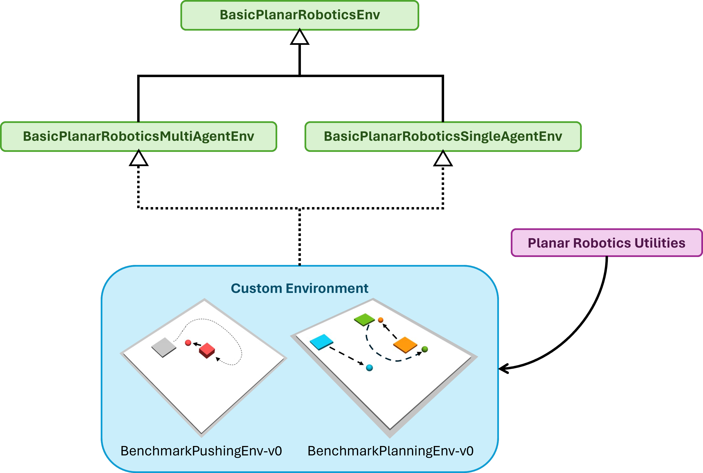

Make Your Own Environment
=========================

GPR offers the possibility to develop research-specific environments with a planar motor system. To this end, GPR has a specific code design:

|br|

The ``BasicPlanarRoboticsEnv`` provides functionality that is required in every RL environment with a planar motor system, such as collision checking 
and rendering functionality as well as the possibility to generate a MuJoCo XML string from the current mover-tile-configuration. Note that the MuJoCo 
model can be customized by the user by defining additional XML strings that are automatically added by the ``BasicPlanarRoboticsEnv``. For example, this 
allows to add custom actuators for the movers, sensors, or robots to the MuJoCo model, so that the user can build a simulation of a specific (industrial) application. 
The ``BasicPlanarRoboticsEnv`` is designed independently from any RL API, since the main focus is on providing functionality that is related to the physics engine and the 
planar motor system.

To provide the user with a basic structure for single-agent and multi-agent RL, GPR contains the ``BasicPlanarRoboticsSingleAgentEnv`` and 
``BasicPlanarRoboticsMultiAgentEnv`` that both include the functionality of the ``BasicPlanarRoboticsEnv``. A custom environment can be inherited from either 
the single-agent or the multi-agent environment. The multi-agent environment follows the PettingZoo parallel API, since all movers, i.e. agents, 
must be updated simultaneously in every control cycle. The single-agent environment follows the Gymnasium API and provides basic functionality for 
standard RL and goal-conditioned RL, such as a ``compute_reward`` method that takes the arguments ``achieved_goal`` and ``desired_goal``. This is a typical 
requirement of Hindsight Experience Replay (HER) implementations of common RL libraries, such as `Stable-Baselines3 <https://stable-baselines3.readthedocs.io/en/master/>`_  
or `Tianshou <https://tianshou.org/en/stable/>`_.

Please use the ``BenchmarkPlanningEnv`` and ``BenchmarkPushingEnv`` as examples for the use of the basic environments.
A detailed documentation of all basic environments and utilities can be found in the following subsections:

.. toctree::
   :maxdepth: 1
   :caption: Basic Environments

   make_own_env/basic_env
   make_own_env/basic_single_env
   make_own_env/basic_multi_env

.. toctree::
   :maxdepth: 1
   :caption: Planar Robotics Utilities

   make_own_env/impedance_control
   make_own_env/rendering
   make_own_env/geometry_2D_utils
   make_own_env/mujoco_utils

.. |br| raw:: html

       